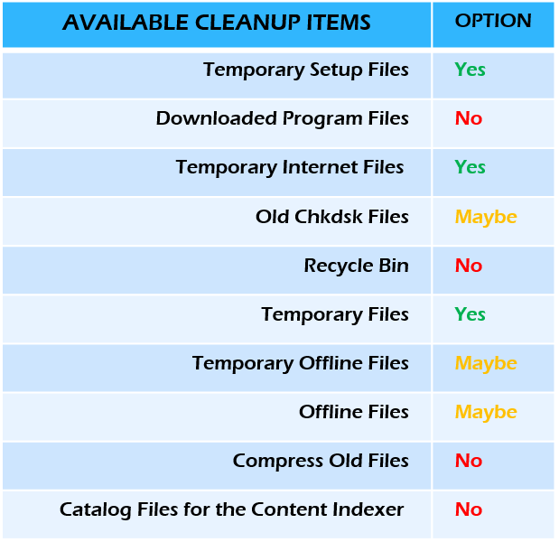
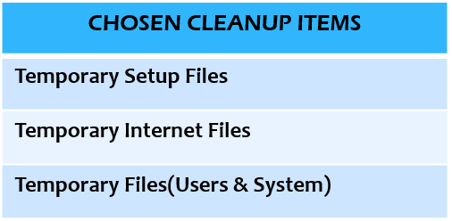
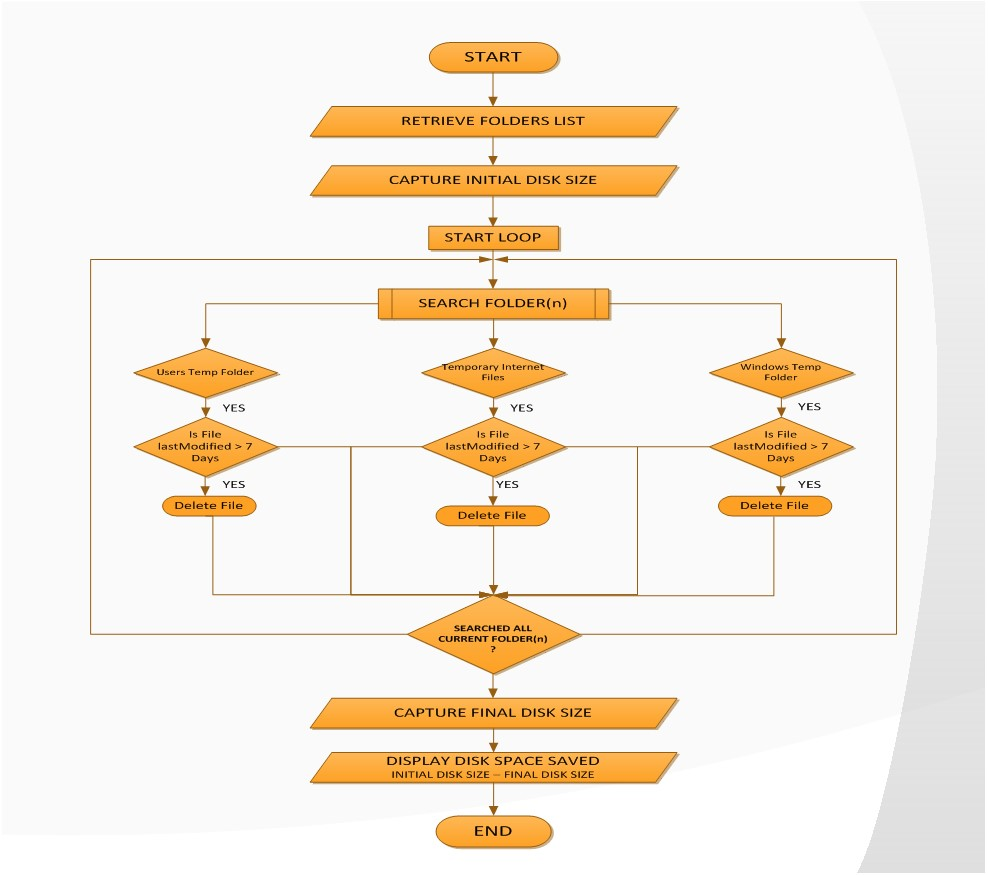
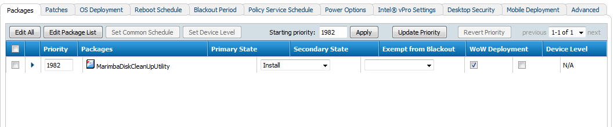
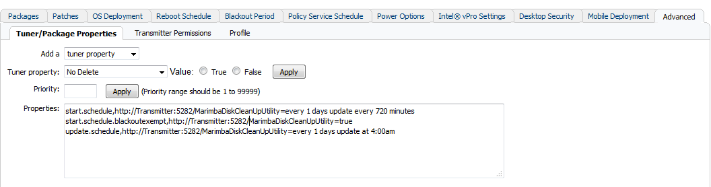

# Disk CleanUp Utility

## IT Administrator Use-Case 
   - Users won’t cleanup their mess.
   - Users have restricted privileges on their client devices. 
   - Administrators rely on automated scheduled tasks/jobs.
   - Don’t purge if it isn’t week old and also not in use.

***
## Windows Disk Cleanup Tool

***

## Architecture – Workflow

***

## Configuration Setup

### Package State via Policy Manager

### Package Properties via Policy Manager

 - start.schedule,http://Transmitter:5282/MarimbaDiskCleanUpUtility=every 1 days update every 720 minutes
 - start.schedule.blackoutexempt, http://Transmitter:5282/MarimbaDiskCleanUpUtility=true or false
 - update.schedule, http://Transmitter:5282/MarimbaDiskCleanUpUtility=every 1 days update at 4:00am

***

### Debug Flag – Tuner Property
marimba. diskcleanuputility.debug.enabled=true/false
